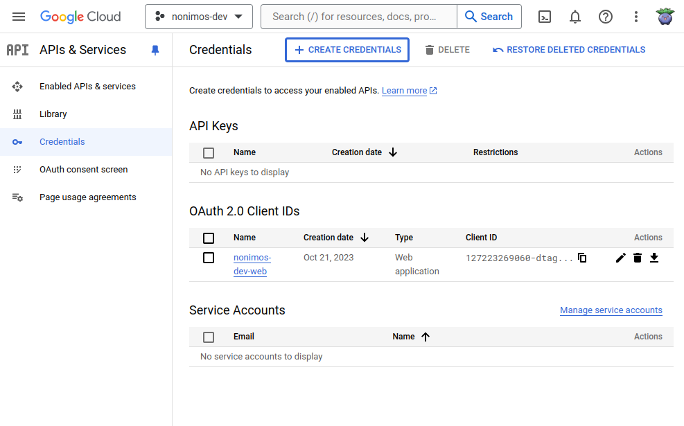
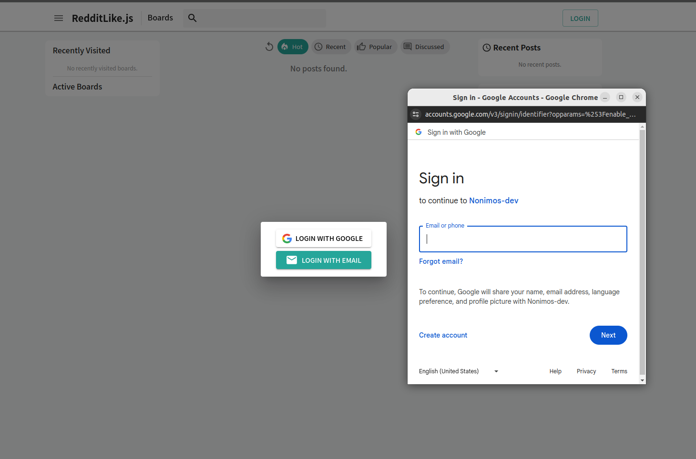

# Setup Google Login (OAuth2)


Please follow this [official google oauth2 docs](https://developers.google.com/identity/protocols/oauth2) and get 





Issue credential and copy Client ID. Open up `frontend/.env` file and replace `NEXT_PUBLIC_OAUTH_GOOGLE_ID` with copied Client ID.

```
NEXT_PUBLIC_OAUTH_GOOGLE_ID="PASTE HERE"
```


Then rebuild the frontend project and start again
```
pnpm build
pnpm start
```

Now, you can use google login in the app.




