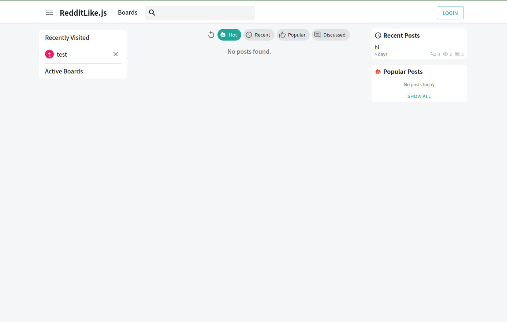

# Quick Start


## Pre-requisite

### 1. Install [node.js(>18)](https://nodejs.org/en/learn/getting-started/how-to-install-nodejs)

### 2. Install [docker](https://docs.docker.com/engine/install/) and [docker-compose](https://docs.docker.com/compose/install/)
 - Make sure user is in docker group with below command(to run docker without sudo)
 ```
 sudo usermod -aG docker $USER
 ```


</br>

## Features

- Reddit-like board-post-comment structure
- Board managing page
- Feature-Rich Text Editor
- Real-time chat(1:1, Group) support

<br/>
<br/>


## Quick Start

1. Clone repository
```sh
git clone https://github.com/5yearsKim/RedditLike.js.git
cd RedditLike.js
```
<br/>

2. Copy `.env` configration

* Setup db and backend environment configuration
```bash
cd envs;
cp .env.db.sample .env.db;
cp .env.backend.sample .env.backend;
cd ..
```

<br/>

3. Start an app through `docker-compose`
```bash
docker compose up
```

If backend server is successfully launched, your console log will show following message
```
redditlike-front  |   ▲ Next.js 13.5.6
redditlike-front  |   - Local:        http://localhost:3010
redditlike-front  |   - Network:      http://0.0.0.0:3010
redditlike-front  | 
redditlike-front  |  ✓ Ready in 41ms
.....

redditlike-back   | [Nest] 19  - 08/15/2024, 8:37:53 AM     LOG [NestApplication] Nest application successfully started +2ms
redditlike-back   | Server is running on http://localhost:3030
```

<br/>

4. Check out with web browser

Open your favorite web browser and access `http://localhost:3010` as below. 




<br/>

