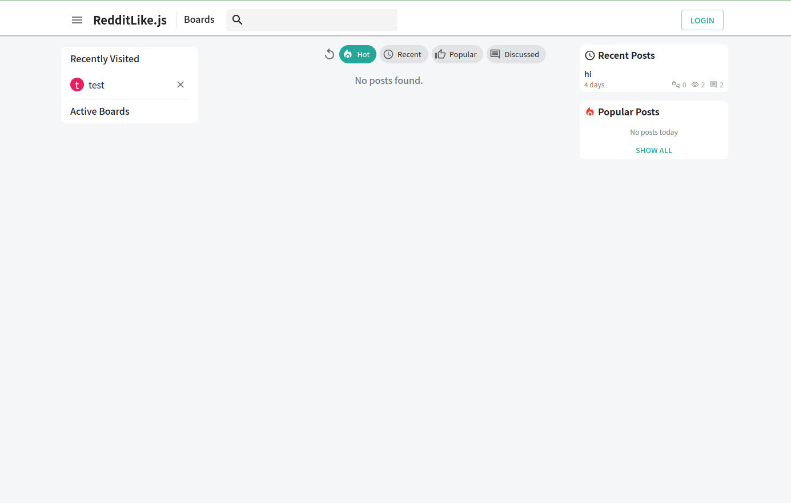

# Launch Manually

You can also launch app manually with following guide.


## 1. Launch Postgres DB instance

There are several ways you can launch Postgres DB >= 14 on your instance. 

1) [Manual Installation](https://www.postgresql.org/)
2) [Docker Image](https://hub.docker.com/_/postgres)
3) Third Party Deployment ([AWS RDS](https://aws.amazon.com/free/database/?gclid=Cj0KCQjwt4a2BhD6ARIsALgH7DpOb_DTtSfe7NCRP41uEqk3227FunFNMAaRG4DuFtj1rMAWtdlAztcaAle5EALw_wcB&trk=fa578b5f-d60e-499f-a297-d9fdfdced64e&sc_channel=ps&ef_id=Cj0KCQjwt4a2BhD6ARIsALgH7DpOb_DTtSfe7NCRP41uEqk3227FunFNMAaRG4DuFtj1rMAWtdlAztcaAle5EALw_wcB:G:s&s_kwcid=AL!4422!3!548652089646!p!!g!!aws%20rds!11550597574!121019969748), [Supabase](https://supabase.com/) and so on)

Just choose any method you are most comfortable with. 

## 2. Launch Backend

Copy sample .env file from template as below:
```
cp envs/.env.backend.sample backend/.env
cd backend
```
And fill in the Postgres config. 

```sh
# DB config
DB_USER=postgres
DB_PASS=postgres
DB_HOST=db
DB_PORT=5432
DB_NAME=redditlike
```

This project use `pnpm` as package manager. Please install `pnpm` if you haven't.

```sh
npm install -g pnpm
pnpm install # install npm packages
pnpm build # compile ts to js
```
Above command will create `/dist` directory at the root. Now, you can start backend server with following command.

```sh
./scripts/start.sh
```

If you check the log as below, you are good.
```
...
[Nest] 15979  - 08/18/2024, 7:32:51 PM     LOG [NestApplication] Nest application successfully started +2ms
Server is running on http://localhost:3030
```


## 3. Launch Frontend 

Copy sample .env file from template as below:
```
cp envs/.env.frontend.sample frontend/.env
cd frontend 
```

And modify .env value as required on project.
```sh
RECOIL_DUPLICATE_ATOM_KEY_CHECKING_ENABLED=false

NEXT_PUBLIC_STAGE=prod
NEXT_PUBLIC_API_URL=http://localhost:3030
NEXT_PUBLIC_API_URL_FROM_SERVER= # required if service is running on docker container, else empty
NEXT_PUBLIC_SOCKET_URL=http://localhost:3031

NEXT_PUBLIC_TEMPORARY_LOGIN_ONLY=true # if enabled, only temporary login is enabled. set false for prod service
NEXT_PUBLIC_OAUTH_GOOGLE_ID= # Google OAuth crendential. required for Google login

NEXT_PUBLIC_RESOURCE_URL= # Required for CDN media distribution
```

Now, build `next` project with command. Launch server with following command.
```sh
pnpm build
PORT=3010 node .next/standalone/server.js
```

Open your favorite browser and access to `http://localhost:3010`. If the below browser shows up, you are good.

